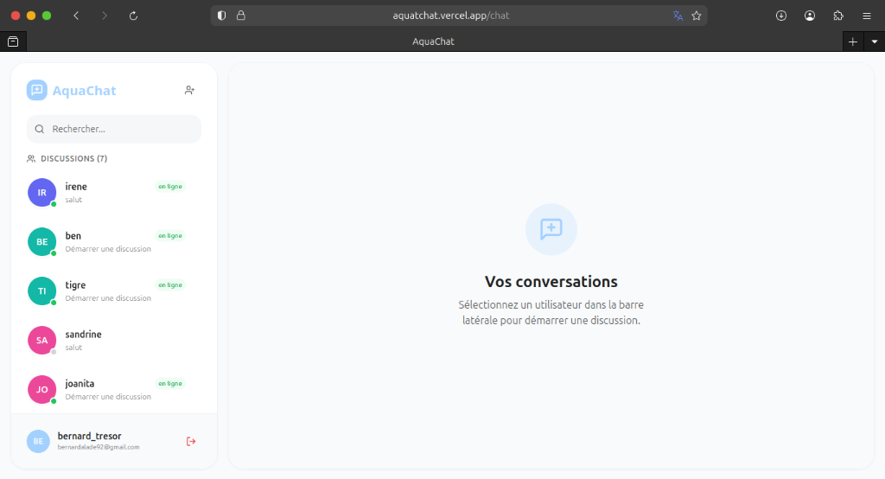

# 🌊 AquaChat - Système de Messagerie Moderne en Temps Réel

AquaChat est une application de messagerie multiplateforme haute performance composée d'un backend en Go/Fiber, d'un frontend Web élégant en React et d'une application mobile native Expo. Conçue pour la rapidité, la sécurité et l'évolutivité.



## 🚀 Fonctionnalités Clés

- **Messagerie en Temps Réel** : Communication instantanée via des WebSockets optimisés.
- **Multiplateforme** : Expérience fluide sur Bureau (Web) et Mobile (Android, via Expo).
- **Discussions de Groupe** : Créez et gérez des chats de groupe avec plusieurs participants.
- **Authentification Sécurisée** : Authentification robuste basée sur JWT pour les APIs et les WebSockets.
- **Présence en Direct** : Suivez quand vos contacts sont en ligne ou hors ligne en temps réel.
- **Gestion Intelligente des Messages** : Accusés de réception et "UI Optimiste" pour une sensation de zéro latence.
- **Design Réactif** : Interface moderne avec effets de glassmorphisme et animations fluides.

## 🛠 Stack Technique

### Backend
- **Langage** : Go (Golang)
- **Framework** : [Gofiber/Fiber](https://gofiber.io/)
- **Base de données** : MongoDB (avec Driver Officiel)
- **Temps réel** : Hub WebSocket personnalisé avec protection contre la concurrence.

### Frontend (Web)
- **Framework** : React 18 avec [Vite](https://vitejs.dev/)
- **Style** : Tailwind CSS
- **Composants** : Radix UI & Icônes Lucide

### Mobile
- **Framework** : [Expo](https://expo.dev/) / React Native
- **Stockage** : AsyncStorage pour les sessions persistantes.
- **Navigation** : React Navigation (Stack & Tabs)

## 📁 Structure du Projet

```bash
├── server/      # Backend Go (API & WebSockets)
├── src/         # Frontend Web (React/Vite)
└── mobile/      # Application Mobile (Expo/React Native)
```

## ⚙️ Démarrage Rapide

### Prérequis
- Go 1.20+
- Node.js 18+
- Instance MongoDB (Locale ou Atlas)

### 1. Configuration du Backend
```bash
cd server
cp .env.example .env # Configurez votre MONGO_URI et JWT_SECRET
go run main.go
```

### 2. Configuration du Frontend Web
```bash
npm install
npm run dev
```

### 3. Configuration du Mobile
```bash
cd mobile
npm install
npx expo start
```

## 🔒 Sécurité
AquaChat utilise le standard industriel JWT (JSON Web Tokens) pour toutes les communications. Les WebSockets sont strictement authentifiés via un "handshake" de jeton pour empêcher l'usurpation d'identité et les accès non autorisés.

## 🤝 Contribution
Les contributions sont les bienvenues ! AquaChat est un projet open-source. N'hésitez pas à :
1. Forker le projet.
2. Créer votre branche de fonctionnalité (`git checkout -b feature/AmazingFeature`).
3. Commiter vos changements (`git commit -m 'Add some AmazingFeature'`).
4. Pusher vers la branche (`git push origin feature/AmazingFeature`).
5. Ouvrir une Pull Request.

## 📄 Licence
Ce projet est sous licence MIT.

---
Fait avec ❤️ par [TresorAlad](https://github.com/TresorAlad)
